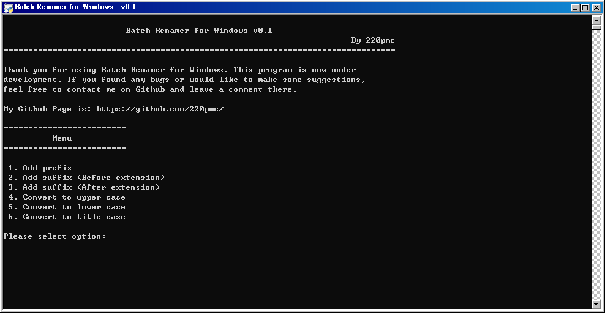

# Batch-Renamer-for-Windows
A batch file renamer for Windows.

# Motivation
Have you ever felt so tired just because you needed to rename hundreds or thousands of files in a folder?
Throguh this program, you can get your job done just by a few simple clicks!

Since this program is under development, there will be more features in the future. If you have any ideas,
enquires or found any bugs, feel free to contact me on Github.

Otherwise, enjoy using the program.

# Instruction
Note: If you enter an invalid input, the program will ask you to input your option again.  

***Step 1***: From the menu, choose the function that you want to perform and enter the corresponding number followed by enter.  
***Step 2***: Type **y** to confirm or **n** to deny. (Not case sensitive)  

***Step 3***: Enter the source directory path. Please do not include single or double qoutes.  
***Step 4 - 5***: Type **y** to confirm or **n** to deny. (Not case sensitive)  

***Step 6***: All Done! Press **enter** to leave the program.  
***Step 7*** (Optional): Check the "log.txt" file for records.  

# Features
1. Users are able to make confirmation for each step.
2. Provided with a log.txt for users to trace records.

# About the program
* Name: Batch Renamer for Windows
* Version: v0.1
* Last Update: 29 Aug 2022

# Future Development
1. Replace the first occurance of a string by another string
2. Repace the last occurance of a string by another string
3. Rename file in numeric sequence (e.g. **Document1.docx**, **Document2.docx**, **Document3.docx**, ...)

# Update Log
29 Aug 2022 - First release of the program
